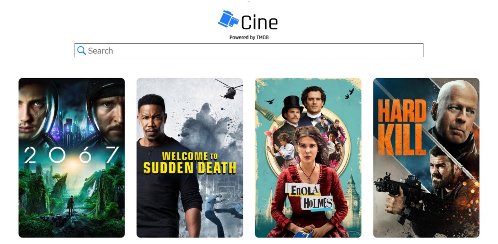

# Project Name
> Cine is a movie search app built with React that uses the TMDB(The Movie Database) API to search for and display data. Demo: https://cineproject-9d016.web.app/

  * New releases section showing the most popular movies released recently
  * A search bar allowing the user to search for a movie by title
  * A page displaying information about a searched movie

## Table of contents
* [Screenshots](#screenshots)
* [Technologies](#technologies)
* [Setup](#setup)
* [Status](#status)
* [Contact](#contact)

## Screenshots


## Technologies
* HTML/CSS
* React - version 16.4
* react-router - version 4.3

## Setup
* Install all dependecies with NPM using the ```npm install``` command
* Run the developmnet server using the ```npm start``` command

## Status
Project is finished

## Contact
Created by Miroslav Tetevenski. Feel free to contact me at miroslav.tetevenski@gmail.com